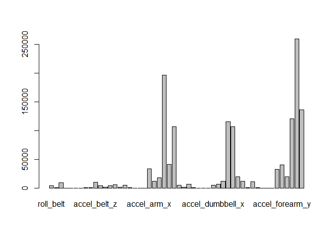
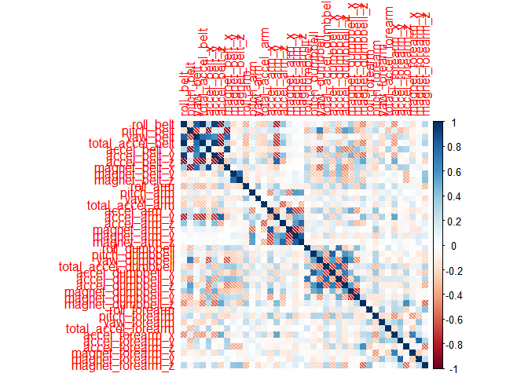

# Background

Given data from motion sensors, can we predict whether a dumbbell exercise was performed or not? In this exercise we train machine learning models to attempt to do just that.

## About the Data

Six participants were asked to perform one set of 10 repetitions of the Unilateral Dumbbell Biceps Curl in five different fashions: exactly according to the specification (Class A), throwing the elbows to the front (Class B), lifting the dumbbell only halfway (Class C), lowering the dumbbell only halfway (Class D) and throwing the hips to the front (Class E).

Based on this, our outcome variable is the class, which has five different values. The problem is thus a multiclass classification problem.

The predictors are numerical data from various IMU (inertial measurement unit) systems positioned on the body and the dumbbells. These units consists of accelerometers, gyroscopes and magnetometers. The raw data are present as well as additional variables like maximum and minimum values.

## Limitation of This Work

The data are time series data, and are 10 repetitions of the five different ways (A-E). The data has been partitioned to aid in using this fact, but for this exercise we will completely ignore the time series aspect and treat each row as an time-independent observation.

We will also ignore individual variations in this exercise.

# Data Exploration and Feature Selection

First we read the data files (using tidyverse libraries):

```r
train <- read_csv("../pml-training.csv")
```

```
## New names:
## * `` -> ...1
```

```
## Warning: One or more parsing issues, see `problems()` for details
```

```
## Rows: 19622 Columns: 160
```

```
## -- Column specification --------------------------------------------------------
## Delimiter: ","
## chr  (34): user_name, cvtd_timestamp, new_window, kurtosis_roll_belt, kurtos...
## dbl (126): ...1, raw_timestamp_part_1, raw_timestamp_part_2, num_window, rol...
## 
## i Use `spec()` to retrieve the full column specification for this data.
## i Specify the column types or set `show_col_types = FALSE` to quiet this message.
```

```r
pred <- read_csv("../pml-testing.csv")
```

```
## New names:
## * `` -> ...1
## Rows: 20 Columns: 160-- Column specification --------------------------------------------------------
## Delimiter: ","
## chr   (3): user_name, cvtd_timestamp, new_window
## dbl  (57): ...1, raw_timestamp_part_1, raw_timestamp_part_2, num_window, rol...
## lgl (100): kurtosis_roll_belt, kurtosis_picth_belt, kurtosis_yaw_belt, skewn...
## i Use `spec()` to retrieve the full column specification for this data.
## i Specify the column types or set `show_col_types = FALSE` to quiet this message.
```

The dimensions are 19622, 160 and 20, 160, respectively. Thus we have 160 variables.

Some variable names:

```r
names(train)[1:30]
```

```
##  [1] "...1"                 "user_name"            "raw_timestamp_part_1"
##  [4] "raw_timestamp_part_2" "cvtd_timestamp"       "new_window"          
##  [7] "num_window"           "roll_belt"            "pitch_belt"          
## [10] "yaw_belt"             "total_accel_belt"     "kurtosis_roll_belt"  
## [13] "kurtosis_picth_belt"  "kurtosis_yaw_belt"    "skewness_roll_belt"  
## [16] "skewness_roll_belt.1" "skewness_yaw_belt"    "max_roll_belt"       
## [19] "max_picth_belt"       "max_yaw_belt"         "min_roll_belt"       
## [22] "min_pitch_belt"       "min_yaw_belt"         "amplitude_roll_belt" 
## [25] "amplitude_pitch_belt" "amplitude_yaw_belt"   "var_total_accel_belt"
## [28] "avg_roll_belt"        "stddev_roll_belt"     "var_roll_belt"
```

We will first look at missing values:

```r
sort(colMeans(is.na(train))*100, decreasing=T)
```

```
##       skewness_roll_belt   skewness_roll_dumbbell  skewness_pitch_dumbbell 
##                 97.97676                 97.95128                 97.93599 
##       kurtosis_roll_belt      kurtosis_picth_belt        kurtosis_yaw_belt 
##                 97.93089                 97.93089                 97.93089 
##     skewness_roll_belt.1        skewness_yaw_belt            max_roll_belt 
##                 97.93089                 97.93089                 97.93089 
##           max_picth_belt             max_yaw_belt            min_roll_belt 
##                 97.93089                 97.93089                 97.93089 
##           min_pitch_belt             min_yaw_belt      amplitude_roll_belt 
##                 97.93089                 97.93089                 97.93089 
##     amplitude_pitch_belt       amplitude_yaw_belt     var_total_accel_belt 
##                 97.93089                 97.93089                 97.93089 
##            avg_roll_belt         stddev_roll_belt            var_roll_belt 
##                 97.93089                 97.93089                 97.93089 
##           avg_pitch_belt        stddev_pitch_belt           var_pitch_belt 
##                 97.93089                 97.93089                 97.93089 
##             avg_yaw_belt          stddev_yaw_belt             var_yaw_belt 
##                 97.93089                 97.93089                 97.93089 
##            var_accel_arm             avg_roll_arm          stddev_roll_arm 
##                 97.93089                 97.93089                 97.93089 
##             var_roll_arm            avg_pitch_arm         stddev_pitch_arm 
##                 97.93089                 97.93089                 97.93089 
##            var_pitch_arm              avg_yaw_arm           stddev_yaw_arm 
##                 97.93089                 97.93089                 97.93089 
##              var_yaw_arm        kurtosis_roll_arm       kurtosis_picth_arm 
##                 97.93089                 97.93089                 97.93089 
##         kurtosis_yaw_arm        skewness_roll_arm       skewness_pitch_arm 
##                 97.93089                 97.93089                 97.93089 
##         skewness_yaw_arm             max_roll_arm            max_picth_arm 
##                 97.93089                 97.93089                 97.93089 
##              max_yaw_arm             min_roll_arm            min_pitch_arm 
##                 97.93089                 97.93089                 97.93089 
##              min_yaw_arm       amplitude_roll_arm      amplitude_pitch_arm 
##                 97.93089                 97.93089                 97.93089 
##        amplitude_yaw_arm   kurtosis_roll_dumbbell  kurtosis_picth_dumbbell 
##                 97.93089                 97.93089                 97.93089 
##    kurtosis_yaw_dumbbell    skewness_yaw_dumbbell        max_roll_dumbbell 
##                 97.93089                 97.93089                 97.93089 
##       max_picth_dumbbell         max_yaw_dumbbell        min_roll_dumbbell 
##                 97.93089                 97.93089                 97.93089 
##       min_pitch_dumbbell         min_yaw_dumbbell  amplitude_roll_dumbbell 
##                 97.93089                 97.93089                 97.93089 
## amplitude_pitch_dumbbell   amplitude_yaw_dumbbell       var_accel_dumbbell 
##                 97.93089                 97.93089                 97.93089 
##        avg_roll_dumbbell     stddev_roll_dumbbell        var_roll_dumbbell 
##                 97.93089                 97.93089                 97.93089 
##       avg_pitch_dumbbell    stddev_pitch_dumbbell       var_pitch_dumbbell 
##                 97.93089                 97.93089                 97.93089 
##         avg_yaw_dumbbell      stddev_yaw_dumbbell         var_yaw_dumbbell 
##                 97.93089                 97.93089                 97.93089 
##    kurtosis_roll_forearm   kurtosis_picth_forearm     kurtosis_yaw_forearm 
##                 97.93089                 97.93089                 97.93089 
##    skewness_roll_forearm   skewness_pitch_forearm     skewness_yaw_forearm 
##                 97.93089                 97.93089                 97.93089 
##         max_roll_forearm        max_picth_forearm          max_yaw_forearm 
##                 97.93089                 97.93089                 97.93089 
##         min_roll_forearm        min_pitch_forearm          min_yaw_forearm 
##                 97.93089                 97.93089                 97.93089 
##   amplitude_roll_forearm  amplitude_pitch_forearm    amplitude_yaw_forearm 
##                 97.93089                 97.93089                 97.93089 
##        var_accel_forearm         avg_roll_forearm      stddev_roll_forearm 
##                 97.93089                 97.93089                 97.93089 
##         var_roll_forearm        avg_pitch_forearm     stddev_pitch_forearm 
##                 97.93089                 97.93089                 97.93089 
##        var_pitch_forearm          avg_yaw_forearm       stddev_yaw_forearm 
##                 97.93089                 97.93089                 97.93089 
##          var_yaw_forearm                     ...1                user_name 
##                 97.93089                  0.00000                  0.00000 
##     raw_timestamp_part_1     raw_timestamp_part_2           cvtd_timestamp 
##                  0.00000                  0.00000                  0.00000 
##               new_window               num_window                roll_belt 
##                  0.00000                  0.00000                  0.00000 
##               pitch_belt                 yaw_belt         total_accel_belt 
##                  0.00000                  0.00000                  0.00000 
##             gyros_belt_x             gyros_belt_y             gyros_belt_z 
##                  0.00000                  0.00000                  0.00000 
##             accel_belt_x             accel_belt_y             accel_belt_z 
##                  0.00000                  0.00000                  0.00000 
##            magnet_belt_x            magnet_belt_y            magnet_belt_z 
##                  0.00000                  0.00000                  0.00000 
##                 roll_arm                pitch_arm                  yaw_arm 
##                  0.00000                  0.00000                  0.00000 
##          total_accel_arm              gyros_arm_x              gyros_arm_y 
##                  0.00000                  0.00000                  0.00000 
##              gyros_arm_z              accel_arm_x              accel_arm_y 
##                  0.00000                  0.00000                  0.00000 
##              accel_arm_z             magnet_arm_x             magnet_arm_y 
##                  0.00000                  0.00000                  0.00000 
##             magnet_arm_z            roll_dumbbell           pitch_dumbbell 
##                  0.00000                  0.00000                  0.00000 
##             yaw_dumbbell     total_accel_dumbbell         gyros_dumbbell_x 
##                  0.00000                  0.00000                  0.00000 
##         gyros_dumbbell_y         gyros_dumbbell_z         accel_dumbbell_x 
##                  0.00000                  0.00000                  0.00000 
##         accel_dumbbell_y         accel_dumbbell_z        magnet_dumbbell_x 
##                  0.00000                  0.00000                  0.00000 
##        magnet_dumbbell_y        magnet_dumbbell_z             roll_forearm 
##                  0.00000                  0.00000                  0.00000 
##            pitch_forearm              yaw_forearm      total_accel_forearm 
##                  0.00000                  0.00000                  0.00000 
##          gyros_forearm_x          gyros_forearm_y          gyros_forearm_z 
##                  0.00000                  0.00000                  0.00000 
##          accel_forearm_x          accel_forearm_y          accel_forearm_z 
##                  0.00000                  0.00000                  0.00000 
##         magnet_forearm_x         magnet_forearm_y         magnet_forearm_z 
##                  0.00000                  0.00000                  0.00000 
##                   classe 
##                  0.00000
```

We see that many variables have mostly missing values (>97%) and we will ignore them:


```r
train <- train[,colMeans(is.na(train))<0.97]
pred <- pred[,colMeans(is.na(pred))<0.97]
```

Doing this we have reduced the amount of variables from 160 to 60. Next we remove the first few variables which we don't need:


```r
train <- train[8:60]
pred <- pred[8:60]
```

Now we look at variances:

```r
vars <- train %>% select(-classe) %>% summarise_all(var)
barplot(height=unlist(vars))
```

<!-- -->

We see that there are some variables with near-zero variance, which we remove. At the same time, we take out column 53, which is our outcome variable.

```r
x_train <- train[1:52]
x_train <- x_train[,unlist(vars)>10]
```

Now we are left with 40 variables. Now for correlation analysis!


```r
corrplot(cor(x_train), method="shade")
```

<!-- -->

The top correlating variables are:

```r
cor(x_train) %>%
  as.data.frame() %>%
  mutate(var1 = rownames(.)) %>%
  gather(var2, value, -var1) %>%
  arrange(desc(value)) %>%
  group_by(value) %>%
  filter(row_number()==1)
```

```
## # A tibble: 781 x 3
## # Groups:   value [781]
##    var1             var2             value
##    <chr>            <chr>            <dbl>
##  1 roll_belt        roll_belt        1    
##  2 total_accel_belt roll_belt        0.981
##  3 accel_belt_y     total_accel_belt 0.928
##  4 accel_belt_y     roll_belt        0.925
##  5 magnet_belt_x    accel_belt_x     0.892
##  6 accel_dumbbell_z yaw_dumbbell     0.849
##  7 yaw_belt         roll_belt        0.815
##  8 magnet_arm_z     magnet_arm_y     0.814
##  9 magnet_arm_x     accel_arm_x      0.814
## 10 accel_dumbbell_x pitch_dumbbell   0.808
## # ... with 771 more rows
```

We can see that sensors that are colocated are also highly correlated, which makes sense. Let's do a PCA:


```r
summary(prcomp(x_train))
```

```
## Importance of components:
##                             PC1      PC2      PC3      PC4       PC5       PC6
## Standard deviation     599.3360 534.1798 471.2423 378.5882 355.91841 254.51816
## Proportion of Variance   0.2635   0.2093   0.1629   0.1051   0.09292   0.04752
## Cumulative Proportion    0.2635   0.4728   0.6357   0.7408   0.83372   0.88123
##                              PC7      PC8       PC9      PC10     PC11     PC12
## Standard deviation     201.03223 173.5671 158.16372 118.24628 97.11655 89.62900
## Proportion of Variance   0.02964   0.0221   0.01835   0.01026  0.00692  0.00589
## Cumulative Proportion    0.91088   0.9330   0.95132   0.96158  0.96850  0.97439
##                            PC13     PC14     PC15     PC16     PC17     PC18
## Standard deviation     76.38259 68.46966 62.58033 56.73592 53.23802 49.73078
## Proportion of Variance  0.00428  0.00344  0.00287  0.00236  0.00208  0.00181
## Cumulative Proportion   0.97867  0.98211  0.98498  0.98734  0.98942  0.99123
##                            PC19     PC20     PC21     PC22     PC23     PC24
## Standard deviation     48.69975 41.91878 37.62741 35.14721 32.92048 30.69033
## Proportion of Variance  0.00174  0.00129  0.00104  0.00091  0.00079  0.00069
## Cumulative Proportion   0.99297  0.99426  0.99530  0.99621  0.99700  0.99769
##                            PC25    PC26     PC27     PC28     PC29     PC30
## Standard deviation     25.50382 23.3600 21.56168 20.75641 17.27820 15.15903
## Proportion of Variance  0.00048  0.0004  0.00034  0.00032  0.00022  0.00017
## Cumulative Proportion   0.99817  0.9986  0.99891  0.99923  0.99945  0.99961
##                            PC31    PC32    PC33    PC34    PC35    PC36    PC37
## Standard deviation     13.98520 9.92110 7.61799 7.28829 6.67614 6.13974 3.75867
## Proportion of Variance  0.00014 0.00007 0.00004 0.00004 0.00003 0.00003 0.00001
## Cumulative Proportion   0.99976 0.99983 0.99987 0.99991 0.99994 0.99997 0.99998
##                           PC38    PC39  PC40
## Standard deviation     3.49985 3.35851 1.098
## Proportion of Variance 0.00001 0.00001 0.000
## Cumulative Proportion  0.99999 1.00000 1.000
```

We see that we would need the first 9 components to explain >95% of the variance.

# Machine Learning

We will first split the data:

```r
inTrain <- createDataPartition(y=train$classe, p=0.8, list=F)
train <- train[inTrain,]
test <- train[-inTrain,]
```

Set up training to use 5-fold cross-validation, then train models. 

```r
control <- trainControl(method="cv", number=5, verboseIter=F)
mod_tree <- train(classe~., data=train, method="rpart", trControl=control)
pred_tree <- predict(mod_tree, test)
mod_rf <- train(classe~., data=train, method="rf", trControl=control)
pred_rf <- predict(mod_rf, test)
mod_svm <- train(classe~., data=train, method="svmPoly", trControl=control)
pred_svm <- predict(mod_svm, test)
```

The models are:

* CART
* Random Forest
* SVM with polynomial kernel

Below are accuraty ratings for each model on the training set:

* CART: 0.5
* RF: 0.99
* SVM: 0.99

## Test Set and Out of Sample Error

Below are detailed classification reports for the three models on the test set (the held-out portion of the training file).


```r
print(confusionMatrix(pred_tree, factor(test$classe)))
```

```
## Confusion Matrix and Statistics
## 
##           Reference
## Prediction   A   B   C   D   E
##          A 822 262 249 242  92
##          B  14 222  17  95  70
##          C  53 130 262 183 156
##          D   0   0   0   0   0
##          E   8   0   0   0 262
## 
## Overall Statistics
##                                           
##                Accuracy : 0.4995          
##                  95% CI : (0.4819, 0.5172)
##     No Information Rate : 0.2858          
##     P-Value [Acc > NIR] : < 2.2e-16       
##                                           
##                   Kappa : 0.3452          
##                                           
##  Mcnemar's Test P-Value : NA              
## 
## Statistics by Class:
## 
##                      Class: A Class: B Class: C Class: D Class: E
## Sensitivity            0.9164  0.36156  0.49621   0.0000  0.45172
## Specificity            0.6231  0.92238  0.80008   1.0000  0.99687
## Pos Pred Value         0.4931  0.53110  0.33418      NaN  0.97037
## Neg Pred Value         0.9490  0.85594  0.88705   0.8343  0.88916
## Prevalence             0.2858  0.19560  0.16821   0.1657  0.18477
## Detection Rate         0.2619  0.07072  0.08347   0.0000  0.08347
## Detection Prevalence   0.5311  0.13316  0.24976   0.0000  0.08601
## Balanced Accuracy      0.7697  0.64197  0.64814   0.5000  0.72430
```

```r
print(confusionMatrix(pred_rf, factor(test$classe)))
```

```
## Confusion Matrix and Statistics
## 
##           Reference
## Prediction   A   B   C   D   E
##          A 897   0   0   0   0
##          B   0 614   0   0   0
##          C   0   0 528   0   0
##          D   0   0   0 520   0
##          E   0   0   0   0 580
## 
## Overall Statistics
##                                      
##                Accuracy : 1          
##                  95% CI : (0.9988, 1)
##     No Information Rate : 0.2858     
##     P-Value [Acc > NIR] : < 2.2e-16  
##                                      
##                   Kappa : 1          
##                                      
##  Mcnemar's Test P-Value : NA         
## 
## Statistics by Class:
## 
##                      Class: A Class: B Class: C Class: D Class: E
## Sensitivity            1.0000   1.0000   1.0000   1.0000   1.0000
## Specificity            1.0000   1.0000   1.0000   1.0000   1.0000
## Pos Pred Value         1.0000   1.0000   1.0000   1.0000   1.0000
## Neg Pred Value         1.0000   1.0000   1.0000   1.0000   1.0000
## Prevalence             0.2858   0.1956   0.1682   0.1657   0.1848
## Detection Rate         0.2858   0.1956   0.1682   0.1657   0.1848
## Detection Prevalence   0.2858   0.1956   0.1682   0.1657   0.1848
## Balanced Accuracy      1.0000   1.0000   1.0000   1.0000   1.0000
```

```r
print(confusionMatrix(pred_svm, factor(test$classe)))
```

```
## Confusion Matrix and Statistics
## 
##           Reference
## Prediction   A   B   C   D   E
##          A 897   0   0   0   0
##          B   0 614   0   0   0
##          C   0   0 528   3   0
##          D   0   0   0 517   0
##          E   0   0   0   0 580
## 
## Overall Statistics
##                                           
##                Accuracy : 0.999           
##                  95% CI : (0.9972, 0.9998)
##     No Information Rate : 0.2858          
##     P-Value [Acc > NIR] : < 2.2e-16       
##                                           
##                   Kappa : 0.9988          
##                                           
##  Mcnemar's Test P-Value : NA              
## 
## Statistics by Class:
## 
##                      Class: A Class: B Class: C Class: D Class: E
## Sensitivity            1.0000   1.0000   1.0000   0.9942   1.0000
## Specificity            1.0000   1.0000   0.9989   1.0000   1.0000
## Pos Pred Value         1.0000   1.0000   0.9944   1.0000   1.0000
## Neg Pred Value         1.0000   1.0000   1.0000   0.9989   1.0000
## Prevalence             0.2858   0.1956   0.1682   0.1657   0.1848
## Detection Rate         0.2858   0.1956   0.1682   0.1647   0.1848
## Detection Prevalence   0.2858   0.1956   0.1692   0.1647   0.1848
## Balanced Accuracy      1.0000   1.0000   0.9994   0.9971   1.0000
```

Summary:

* CART: 0.495 accuracy (0.505 out-of-sample error)
* RF: 0.9929 accuracy (0.0071 out-of-sample error)
* SVM: 0.9924 accuracy (0.0076 out-of-sample error)

Both random forest and SVM perform well, and I've chosen RF to predict with on the testing file.

## Predicting on the test file


```r
predict(mod_rf, pred)
```

```
##  [1] B A B A A E D B A A B C B A E E A B B B
## Levels: A B C D E
```

